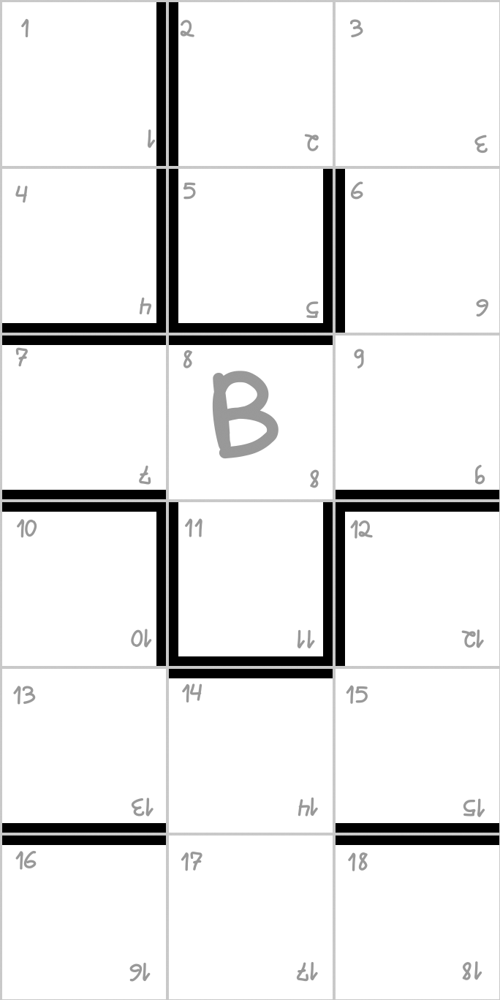
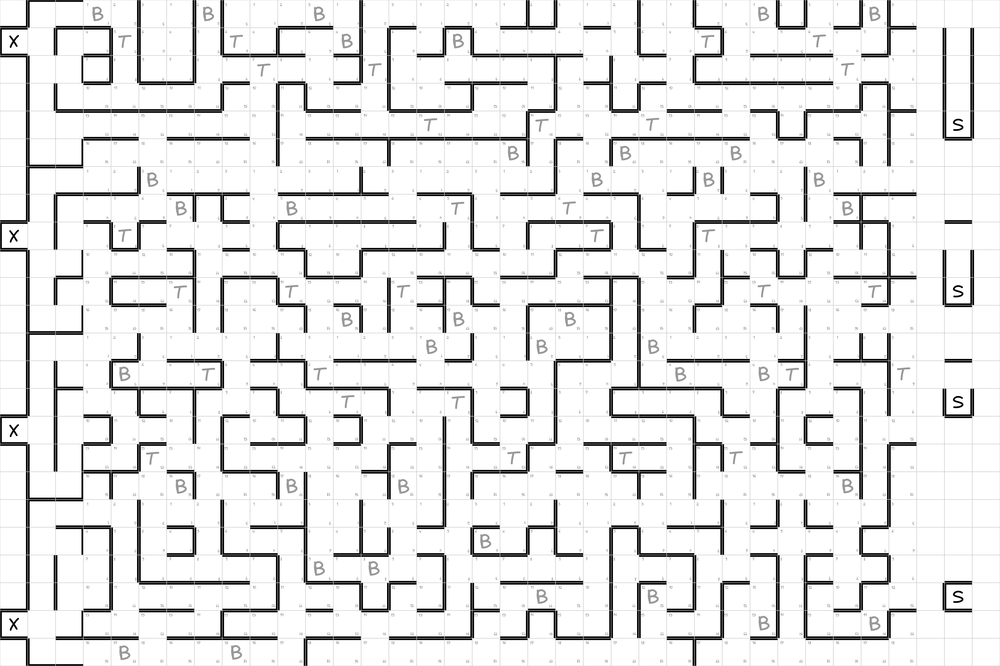
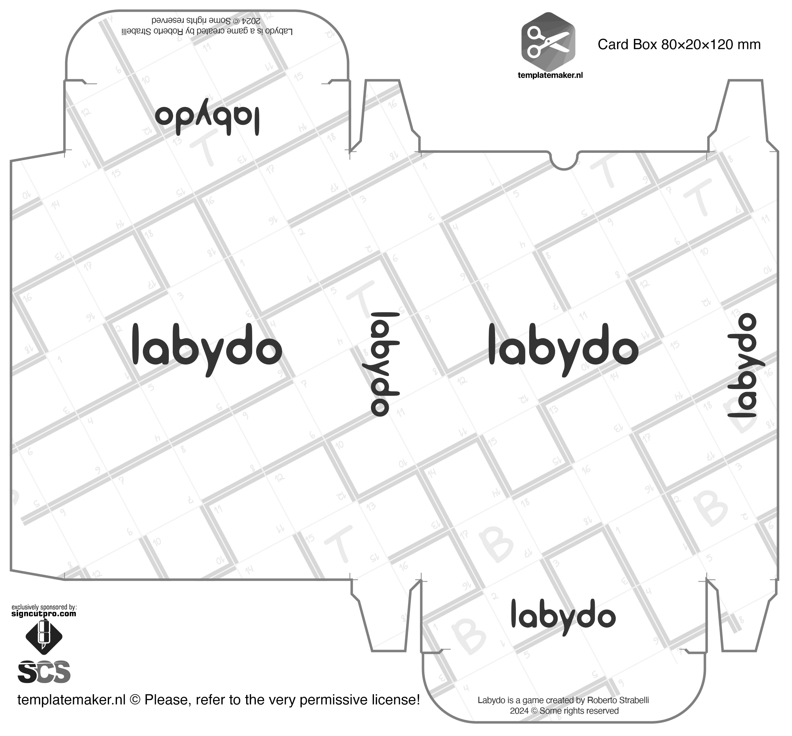

***Tradukita el la portugala***

Konservite por posteularo ĉe https://archive.org/details/labydo la 13-an de januaro 2025.

**Labydo** estas dinamika kaj strategia tabulludo por ludantoj, kiuj ĝuas konkuradon kaj taktikajn defiojn. Ĝi estas ideala por ŝatantoj de klasikaj ludoj kiel Ludo, kiuj serĉas pli defian sperton kaj partiojn plenajn de interagado kaj strategio.

Sur modula tabulo, kiu kreskas dum la ludo progresas, la ludantoj konstruas labirinton kaj samtempe kuras por atingi la eliron. Sed atentu: malbone planitaj vojoj kaj surprizaj bataloj povas tute ŝanĝi la direkton de la ludo! *Preparu vin por navigi la plej neantaŭvideblan labirinton, kiun vi iam vidis!*

---

# REGULOJ

- Ludantoj: 2-4
- Rekomendita aĝo: 10+
- Meza daŭro de partio: 40 min.

## Celo

**Labydo** estas kursa ludo en modula labirinto por 2 ĝis 4 ludantoj. La *enirkartoj* markas la komencon, la *labirintokartoj* formas la vojojn, kaj la *elirkartoj* enhavas la finan celon.

Ĉiu *labirintokarto* enhavas 18 numeritajn spacojn, traireblajn per peonoj, dum muroj inter la spacoj formas la vojojn. La labirinto kreskas dum novaj kartoj aldoniĝas. Venkas tiu, kiu unue atingas la eliron.

## Komponaĵoj

- 4 peonoj
- 3 sesflankaj ĵetkuboj
- 40 labirintokartoj
- 4 elirkartoj
- 4 enirkartoj

## Preparado

1. Miksu la tri kartarojn aparte (*labirintokartoj*, *enirkartoj* kaj *elirkartoj*).
2. Donu al ĉiu ludanto 5 *labirintokartojn* kaj 1 *enirkarton*. Ludantoj povas kaŝi aŭ montri siajn kartojn.
3. Formu tri stakojn kun la restantaj kartoj.
4. Ĉiu ludanto metas sian *enirkarton* sur la tablon kun sia peono ĉe la komenca spaco. *Enirkartoj* devas esti vicigitaj por formi unuan vicon.
5. Lasu bonan liberan spacon antaŭe por la ekspansio de la labirinto.
6. Ĉiu ludanto devas aldoni unu *labirintokarton* apud sia *enirkarto*, certigante ke la randoj kaj verticoj de la kartoj kongruas.
7. Elektu la unuan ludanton libere.

## Ludmekaniko

Ekzistas kvar malsamaj moviĝoj dum ludo de **Labydo**. La moviĝo devas esti komunikita al la aliaj ludantoj antaŭ ol ĵeti la kubojn.

### 1- Normala aŭ moviĝa ago

La aktuala ludanto ĵetas la tri kubojn samtempe kaj agas laŭ la rezulto. La peono moviĝas nur vertikale kaj horizontale.

- <u>Du aŭ tri sekvaj aŭ samaj numeroj (ekz.: 1, 2 kaj 5 aŭ 4, 4 kaj 2)</u>: poziciigu unu el viaj *labirintokartoj* apud alia *labirintokarto*, kiu jam estas sur la tablo kaj ĵetu denove la kubojn por movi vian peonon la ricevitan nombron da spacoj (aŭ malpli) en la direkto, kiun vi deziras.
- <u>Alia rezulto</u>: movu vian peonon la ricevitan nombron da spacoj (aŭ malpli) en la direkto, kiun vi deziras.

#### Notoj

- En normala moviĝo, la ludanto povas iri la ekzaktan nombron ricevitan sur la kuboj, malpli ol tio, aŭ ne moviĝi.
- La aldonitaj *labirintokartoj* povas esti paralelaj aŭ perpendiklaj, kondiĉe ke la bordoj kaj verticoj aligniĝu.
- Oni ne devas supermetigi kartojn.
- Se iam la ludanto restas sen *labirintokartoj* por aldoni, li devas preni pliajn 5 el la stako. Se ĉiuj kartoj de la stako estas en la ludo, la plej proksima karto al la *enirkarto* de la aktuala ludanto kaj la sekvantaj devas esti uzataj laŭnecese, ĉiam forigante per la unuaj, kiuj estis aldonitaj kaj en la direkto de la tabula progreso.

### 2- Teletransporta moviĝo

Se vi estas sur teletransporta spaco (*T*), la ludanto povas moviĝi al apuda *labirintokarto* en ajna direkto. Li devas anonci la direkton kaj sian intencon antaŭ ol ĵeti la kubojn. La rezulto de la kuboj donos la numeron de la spaco, kie li devige alteriĝos.

- Se la spaco estas okupita, estos atako kaj ambaŭ interŝanĝos lokojn.
- Se li falas sur blokadan spacon (*B*) okupitan de alia ludanto, la teletransporto malsukcesos kaj la ludanto perdos sian vicon.

### 3- Moviĝo por akiri elirkarton

Post kiam li trairis almenaŭ 5 *labirintokartojn*, metitajn de li aŭ ne, kaj ne estante sur speciala blokada spaco (*B*), la ludanto povas en sia vico provi akiri *elirkarton*. Deklaru, ke vi provos akiri *elirkarton* kaj ĵetu la tri kubojn.

- <u>Tri sekvaj aŭ samaj numeroj (ekz.: 2, 3 kaj 4 aŭ 5, 5 kaj 5)</u>: prenu la unuan *elirkarton* de la supro de la stako kaj poziciigu ĝin kie vi deziras.
- <u>Alia rezulto</u>: restu en la aktuala pozicio.

### Notoj

- La ludanto, kiu ne sukcesas akiri *elirkarton* en la unua provo, estas libera provi en la sekva vico aŭ daŭrigi fari normalajn moviĝojn.
- La *elirkarto* konkerita de ludanto estas alirebla al la aliaj, eĉ tiuj, kiuj ankoraŭ ne trairis 5 *labirintokartojn*.

### 4- Elira moviĝo por venki la ludon

1. Ne estante sur blokada spaco (*B*), estante sur la *elirkarto* aŭ ne, anoncu ke vi provos la eliron kaj ĵetu la kubojn. Estos necese ricevi la ekzaktan nombron por alteriĝi sur la elirspaco (*S*) aŭ la sumon de tri sur la kuboj (1, 1 kaj 1).
2. En partioj kun pli ol du ludantoj la ludo povas daŭri post la unua venkinto:
    - La venkinta peono kaj la *elirkarto* estas forigitaj de la tabulo. Tiu karto devas esti metita sub la respondan stakon. En ĝia loko devas esti metita *labirintokarto*.
    - Se aliaj peonoj estas sur la *elirkarto*, ili devas esti movitaj al la unuaj numeraj spacoj de la najbaraj *labirintokartoj*, laŭ elekto de la venkinto, kiu devas realigi tiujn agojn.

## Batalreguloj

1. Ludanto ne povas salti super alia. Li devas halti en la antaŭa spaco.
2. Kiam oni ricevas la ekzaktan nombron por alteriĝi sur spaco okupita de alia ludanto, se oni elektas tiun agon, ambaŭ interŝanĝas lokojn, kun la atakita ludanto moviĝanta al la spaco kie la atakanta ludanto estis. La atako ne funkcias se la atakita ludanto estas sur blokada spaco (*B*).
3. Atakita ludanto povas revenĝi en sia vico, kaj tiukaze la unua atakinto estos teletransportita al sia *enirkarto* kaj devos rekomenci kiel la unuan fojon, devante trairi almenaŭ 5 *labirintokartojn* por rajti veti pri *elirkarto*. Se estas malplena spaco inter la *enirkarto* kaj la resto de la tabulo, aliaj *labirintokartoj* devas esti aldonitaj en la necesa kvanto.
4. Se batalo okazas sur *elirkarto*, la atakita ludanto definitive eliros el la ludo.
5. Se post ĝenerala batalo restas nur unu ludanto, li venkas.

## Pri la specialaj spacoj

Kelkaj kartoj havas specialajn spacojn, kiuj permesas al la ludanto realigi specifajn agojn.

- **Teletransporto:** signita per la litero *T*, permesas salti de unu *labirintokarto* al alia, kiu estas konektita al ĝi. Konsultu la punkton *"Teletransporta moviĝo"* por pli da detaloj.

- **Blokado:** signita per la litero *B*, imunigas la ludanton kontraŭ atakoj. Tamen, estante sur ĝi, la sola permesita ago estas la moviĝo.

- **Eliro:** trovebla nur sur la *elirkartoj* kaj signita per la litero *S*. En elira moviĝo, se la ludanto sukcesas ricevi la ekzaktan nombron por alteriĝi sur ĝi aŭ la sumon de tri (1, 1 kaj 1), li venkos la ludon.

## Strategiaj sugestoj

- Uzu la specialajn teletransportajn spacojn (*T*) por rapide moviĝi aŭ realigi atakojn.
- Provizore alianci sin kun alia ludanto povas esti avantaĝa.
- Atentu kiam vi aldonas *labirintokarton*. La karto kaj la pozicio povas helpi aŭ malrapidigi vian kuradon, same kiel tiun de viaj konkurantoj. Tio validas ankaŭ por la poziciigo de *elirkarto*.
- Zorgu: la areo de la *elirkarto* estas mortiga kaj esti je unu spaco for de la elirspaco (*S*) malaltigos viajn ŝancojn venki.

---

# Presaj instrukcioj

Presu la dokumenton **cartas_print_A4.pdf** uzante 8 foliojn de blanka A4-papero kun alta grampezo, de 200 aŭ 250 gramoj. Poste remetu la foliojn en la presilo por presi sur la alia flanko 8 fojojn la dokumenton **cartas_print_back_A4.pdf**. Por protekti la kartojn, presu ankaŭ la skatolon por munti, kiu estas en la dokumento **caixa_print_A4.pdf**. Zorge tranĉu la kartojn, akiru tri kubojn kaj kvar peonojn kaj amuzu vin kun viaj amikoj kaj familianoj :)

---

# Kromaĵoj

## Ekzemplo de labirintokarto

## Ekzemplo de plene kunmetita tabulo

## Ludskatolo por presi kaj kunmeti

## Teknikaj detaloj de la kartoj

- Kradita: griza, kun 2px sur la randoj kaj 4px interne.
- Bato: nigra, 15px sur la randoj kaj 30px interne.

**kartaj mezuroj**

- 3x6 kvadratoj de 228 pikseloj
- 684x1368 pikseloj
- 5,79x11,58 cm

**totalaj mezuradoj**

- 4x12 kartoj - 24x36 ĉeloj
- 8208x5472 pikseloj
- 69,49x46,331 cm

---

# Versiaro

1.0 - Komenca eldono  
2.0 - Simpligo de labirinto  
Lasta revizio: 22:50 2025-01-14

---

# Kopirajto

Labydo estas ludo kreita de Roberto Strabelli en decembro 2024.  
robertostrabelli@gmail.com

[Kelkaj rajtoj rezervitaj](license.md). Resume: vi povas presi por ludi, vi ne povas presi por komerci.
