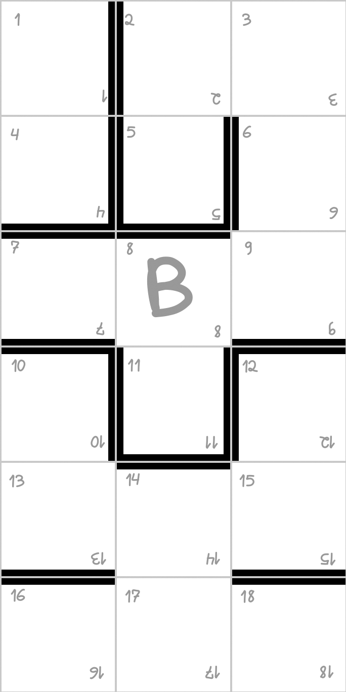

**Labydo** is a dynamic and strategic board game for players who enjoy competition and tactical challenges. Perfect for fans of classic games like Ludo who want a more challenging experience and gameplay full of interaction and strategy.

On a modular board that grows as the game progresses, players build a labyrinth while racing to reach the exit. But beware: poorly planned paths and player confrontations can completely change the course of the game! *Prepare to navigate the most unpredictable maze you've ever encountered!*

---

# RULES

- Players: 2-4
- Recommended age: 10+
- Average game length: 40 min.

## Objective

**Labydo** is a race game through a modular labyrinth for 2 to 4 players. The game board is built from three types of tiles: *entrance tiles* where players start, *labyrinth tiles* that form the pathways, and *exit tiles* containing the victory spaces.

Each labyrinth tile features 18 numbered spaces connected by pathways, with walls creating the maze-like structure. Players move their pawns through these spaces as the labyrinth expands with each new tile added. The first player to reach an exit space wins.

## Components

- 4 pawns
- 3 six-sided dice
- 40 labyrinth tiles
- 4 exit tiles
- 4 entrance tiles

## Setup

1. Shuffle the three groups of tiles separately (*labyrinth tiles*, *entrance tiles*, and *exit tiles*).
2. Deal 5 *labyrinth tiles* and 1 *entrance tile* to each player. Players may choose to keep their tiles hidden or visible.
3. Form three separate draw piles with the remaining tiles.
4. Each player places their *entrance tile* and their pawn on the corresponding space. All *entrance tiles* should be aligned to form the starting row.
5. Leave plenty of space in front for the labyrinth to expand.
6. Each player then places one *labyrinth tile* connecting to their *entrance tile*, in any orientation they wish, as long as the edges and corners of the tiles align.
7. Choose a starting player by any method.

## Gameplay

There are four different types of actions in **Labydo**. Players must announce their intended action before rolling the dice.

### 1- Standard Movement

The active player rolls all three dice simultaneously and acts according to the result. Pawns move only orthogonally (vertically and horizontally).

- <u>If you roll two or three sequential or matching numbers (e.g., 1, 2, and 5 or 4, 4, and 2)</u>: Place one of your *labyrinth tiles* adjacent to any tile already on the board, then roll again to move your pawn up to the number of spaces shown.
- <u>Any other result</u>: Move your pawn up to the number of spaces shown in any direction.

#### Notes:

- During a standard movement, you may move exactly the number shown on the dice, fewer spaces, or not move at all.
- *Labyrinth tiles* may be placed parallel or perpendicular to existing tiles, as long as edges and corners align.
- Tiles cannot overlap.
- If you run out of *labyrinth tiles*, draw 5 more from the pile. If the draw pile is empty, take tiles from the board starting with those closest to your *entrance tile*, working forward. Only take tiles as needed, beginning with the earliest placed tiles.

### 2- Teleport Action
When on a teleport space (*T*), you may move to an adjacent *labyrinth tile* in any direction. Declare your intended direction before rolling the dice. The dice result determines the space number where you must land.

- If the target space is occupied, this initiates combat and both pawns swap positions.
- If you land on an occupied blocking space (*B*), the teleport fails and your turn ends.

### 3- Acquiring an Exit Tile

After traversing at least 5 *labyrinth tiles* (placed by any player) and while not on a blocking space (*B*), you may attempt to acquire an *exit tile* on your turn. Declare your attempt before rolling all three dice.

- <u>If you roll three sequential or matching numbers (e.g., 2, 3, and 4 or 5, 5, and 5)</u>: Take the top *exit tile* and place it where you wish.
- <u>Any other result</u>: Stay in your current position.

#### Notes:

- If unsuccessful, you may try again on your next turn or continue with standard movements.
- Once placed, *exit tiles* are accessible to all players, even those who haven't crossed 5 *labyrinth tiles* yet.

### 4- Victory Move

1. When not on a blocking space (*B*), whether on an *exit tile* or not, you may attempt to win by announcing a victory move and rolling the dice. You must either roll the exact number needed to reach the exit space (*S*) or roll a sum of three (1, 1, and 1).
2. In games with more than two players, play can continue after the first winner:
    - Remove the winning pawn and *exit tile* (place it at the bottom of its deck). Replace the exit tile with a *labyrinth tile*.
    - If other pawns were on the *exit tile*, the winner moves them to space number one on adjacent *labyrinth tiles* of their choice.

## Combat Rules

1. You cannot jump over other pawns. You must stop in the space before an occupied space.
2. If you roll the exact number to land on an occupied space and choose to do so, both pawns swap positions. This attack fails if the defending pawn is on a blocking space (*B*).
3. An attacked player may counterattack on their turn. If successful, the original attacker must return to their *entrance tile* and start over, needing to cross 5 *labyrinth tiles* again before attempting to acquire an *exit tile*. If there's a gap between the *entrance tile* and the board, add necessary *labyrinth tiles* to bridge it.
4. If combat occurs on an *exit tile*, the attacked player is eliminated from the game.
5. If only one player remains after a series of battles, they win.

## Special Spaces

Some tiles contain special spaces that grant specific actions:

- **Teleport (T):**  Allows jumping between connected labyrinth tiles. See "Teleport Action" for details.
- **Blocking (B):**  Grants immunity from attacks. However, only standard movement is allowed while on these spaces.
- **Exit (S):**  Found only on *exit tiles*. Landing here with an exact roll or a sum of three (1, 1, 1) wins the game.

## Strategy Tips

- Use teleport spaces (*T*) for quick movement or surprise attacks.
- Temporary alliances can be beneficial.
- Consider tile placement carefully - both *labyrinth and exit tiles* can help or hinder any player's progress.
- Be cautious: the *exit tile* area is deadly, and being one space away from the exit space (*S*) reduces your chances of winning.

---

# Extras

## Labyrinth tile example

## Complete board example

## Printable package

## Technical card details

- Grid: gray, 2px borders and 4px internal lines
- Walls: black, 15px borders and 30px internal walls

**Card Dimensions**
  
- 3x6 squares of 228 pixels each
- 684x1368 pixels
- 5.79x11.58 cm (2.28x4.56 inches)
- 
**Total Board Dimensions**
  
- Complete labyrinth (4x10 cards - 24x30 cells)
- 5472x6840 pixels
- 46.33x57.91 cm (18.24x22.80 inches)

---

# Version

Version 1.0  
Last updated: 21:50 01/12/2025

---

# Copyright

Labydo is a game created by Roberto Strabelli in December 2024.  
robertostrabelli@gmail.com  
[Some rights reserved](license.md)

In short: you may print it for play, but not for commercial purposes.
